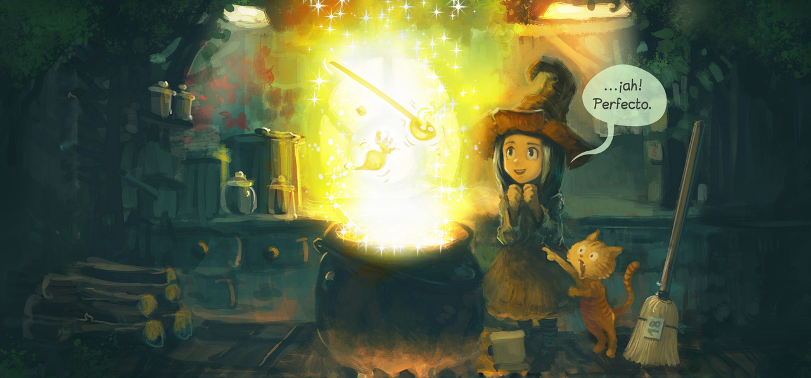
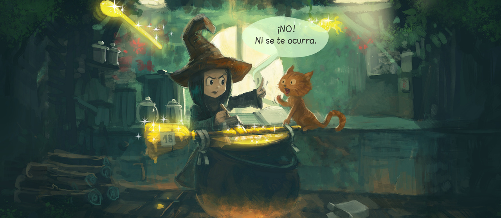
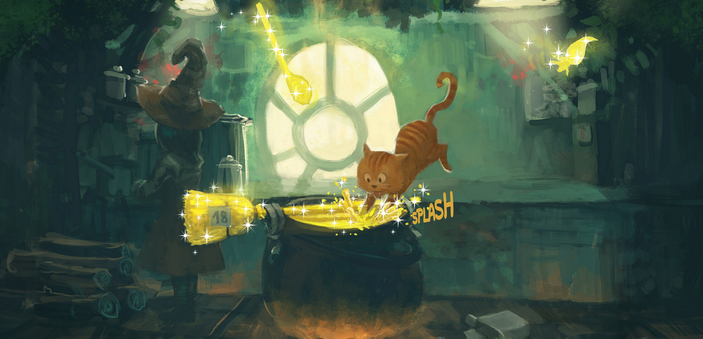

# Episode 1 Page 2 Human Accessibility and Fidelity Review

**Status:** `APPROVED — SCOPED HUMAN REVIEW`

**Scope:** Engineering prototype only. This packet records approval of the three Spanish descriptions, the human visual-fidelity judgment covered below, and the attribution/modification notice. It does not approve physical-device or motion-craft evidence, publication, final-study content, recruitment, or protocol freeze.

## Quick review path

1. From the repository root, run `npm run dev` and open the URL printed by Vite.
2. Select **Static**. At one fixed viewport, inspect panels 01–03 in reading order for content, crop, text, color, and compression.
3. Select **Motion**, choose **Restart motion**, and inspect the same sequence. Confirm that the panel content and asset quality remain unchanged and that only the restrained camera/light treatment differs.
4. Compare the live panels with the embedded 1280-pixel JPEG references below. Use the linked 640-, 1280-, and 2275-pixel WebP/JPEG files for the detailed fidelity checks.
5. Review the three Spanish descriptions and the attribution proposal. The exact approval evidence and immutable decision record appear at the end of this packet.

Do not treat this review as physical-device, performance, publication, or final-study approval.

## Panel 01 — Transformation



**Approved Spanish description**

> Una luz amarilla rodea varios objetos que flotan sobre el caldero. Pepper sonríe con las manos juntas y dice: «…¡ah! Perfecto.» Carrot está a su lado, junto a una escoba.

This description replaces the inferred celebration in the former provisional copy with visible posture and expression, and it does not identify every object inside the glow.

**Focused questions**

- **Factual accuracy:** Are the glow, floating objects, Pepper's expression and posture, and Carrot's position beside Pepper and the broom described as visibly shown?
- **Dialogue/sound:** Is the visible dialogue «…¡ah! Perfecto.» essential and transcribed exactly?
- **Over-interpretation:** Do “floating” or the stated character positions imply more than the still image establishes?
- **Sequence clarity:** Does this establish the completed potion beat clearly enough before panel 02?

## Panel 02 — Intervention



**Approved Spanish description**

> Pepper pone una mano frente a Carrot, que estira las patas hacia una escoba resplandeciente sobre el caldero, y dice: «¡NO! Ni se te ocurra.»

This description records the visible hand and reach without asserting that Pepper successfully stops Carrot or assigning an intention to either character.

**Focused questions**

- **Factual accuracy:** Do Pepper's hand, Carrot's reach, the glowing broom, and their positions relative to the cauldron match the image?
- **Dialogue/sound:** Is «¡NO! Ni se te ocurra.» essential, assigned to Pepper, and transcribed exactly?
- **Over-interpretation:** Does “toward” remain observational rather than claiming Carrot's intention?
- **Sequence clarity:** Does the description connect panel 01's setup to panel 03's consequence without narrating unseen action?

## Panel 03 — Consequence



**Approved Spanish description**

> Carrot aterriza con las patas delanteras sobre la escoba que cruza el caldero y el líquido salpica con un «SPLASH». Pepper aparece parcialmente oculta a la izquierda.

This description records the visible contact and splash without claiming that Carrot deliberately submerges the broom.

**Focused questions**

- **Factual accuracy:** Do Carrot's position, the broom across the cauldron, the splash, and Pepper's partial visibility match the image?
- **Dialogue/sound:** Is the visible «SPLASH» essential and transcribed exactly?
- **Over-interpretation:** Does “lands” describe the depicted action without assigning intent or an unseen starting point?
- **Sequence clarity:** Is the consequence of panel 02 understandable while keeping the description concise enough for an image alternative?

## Fidelity review

### Recorded engineering evidence — not human approval

| Evidence | Recorded result | Limitation |
| --- | --- | --- |
| Deterministic generation and import manifest | All 18 expected files were produced twice with matching hashes and were verified again at import. Dimensions are recorded for 640, 1280, and 2275 pixels in WebP and JPEG. | Reproducibility and file identity do not establish perceived fidelity. |
| Automated metadata and decoded-pixel checks | Every output decoded to the planned dimensions with three sRGB channels and the attached 480-byte built-in sRGB ICC profile. Per-file error metrics are recorded against an unencoded crop-first reference. | Metrics do not rule out visible seams, clipping, banding, color concerns, or objectionable artifacts. |
| Bounded agent visual review | All panels at 640 and 2275 pixels in both formats were reported free of obvious seams, clipping, color shifts, or compression failures; lettering, sparkles, gradients, and dark texture remained coherent. | This was not human approval, a prescribed color-managed browser comparison, or a physical-device review. |
| Static/Motion source inspection | Both modes render the same panel data, responsive source sets, dimensions, and `ReaderPicture`; mode changes control the treatment rather than selecting different artwork. | Source inspection alone cannot catch presentation-level differences; the separate human judgment below supplies that review. |

The detailed engineering evidence remains in the [actual derivative manifest](../asset-provenance/pepper-carrot-ep01-page2-derivatives.manifest.json).

### Human fidelity judgment — approved within packet scope

Inspect at intended CSS size and, where practical, at 100% and 200% zoom:

- [x] **Crop seams:** No white, near-white, or anti-aliased frame seam appears on any edge.
- [x] **Clipped content:** No speech bubble, dialogue, «SPLASH», face, paw, broom, sparkle, or other meaningful subject is unexpectedly clipped.
- [x] **Color shifts:** Teal shadows, orange character tones, and yellow effects remain consistent across formats and widths on a color-managed display.
- [x] **Gradients:** Bright yellow/white glow and dark painted transitions remain smooth, without new bands or broken falloff.
- [x] **Compression:** Lettering, sparkles, high-contrast edges, fur, and painted texture show no distracting ringing, blocking, smearing, or mosquito noise.
- [x] **Format parity:** WebP and JPEG show the same crop, content, color intent, and legibility for each panel and width.
- [x] **Width parity:** The 640-, 1280-, and 2275-pixel versions preserve composition, aspect ratio, text, subjects, and expected detail without a width-specific defect.
- [x] **Static/Motion asset parity:** At the same viewport, switching modes does not change the selected image URL, crop, dimensions, color, compression, or reading order; only the specified transform/opacity treatment differs.

This approval is limited to the visual-fidelity checks represented by this packet. It is not physical-device, frame-performance, touch/zoom-on-device, or motion-craft evidence.

### Files for direct comparison

| Panel | 640 WebP | 640 JPEG | 1280 WebP | 1280 JPEG | 2275 WebP | 2275 JPEG |
| --- | --- | --- | --- | --- | --- | --- |
| 01 | [Open](../../public/content/pepper-carrot/episode-01/page-02/pepper-carrot-ep01-e01p02-panel-01-w0640.webp) | [Open](../../public/content/pepper-carrot/episode-01/page-02/pepper-carrot-ep01-e01p02-panel-01-w0640.jpg) | [Open](../../public/content/pepper-carrot/episode-01/page-02/pepper-carrot-ep01-e01p02-panel-01-w1280.webp) | [Open](../../public/content/pepper-carrot/episode-01/page-02/pepper-carrot-ep01-e01p02-panel-01-w1280.jpg) | [Open](../../public/content/pepper-carrot/episode-01/page-02/pepper-carrot-ep01-e01p02-panel-01-w2275.webp) | [Open](../../public/content/pepper-carrot/episode-01/page-02/pepper-carrot-ep01-e01p02-panel-01-w2275.jpg) |
| 02 | [Open](../../public/content/pepper-carrot/episode-01/page-02/pepper-carrot-ep01-e01p02-panel-02-w0640.webp) | [Open](../../public/content/pepper-carrot/episode-01/page-02/pepper-carrot-ep01-e01p02-panel-02-w0640.jpg) | [Open](../../public/content/pepper-carrot/episode-01/page-02/pepper-carrot-ep01-e01p02-panel-02-w1280.webp) | [Open](../../public/content/pepper-carrot/episode-01/page-02/pepper-carrot-ep01-e01p02-panel-02-w1280.jpg) | [Open](../../public/content/pepper-carrot/episode-01/page-02/pepper-carrot-ep01-e01p02-panel-02-w2275.webp) | [Open](../../public/content/pepper-carrot/episode-01/page-02/pepper-carrot-ep01-e01p02-panel-02-w2275.jpg) |
| 03 | [Open](../../public/content/pepper-carrot/episode-01/page-02/pepper-carrot-ep01-e01p02-panel-03-w0640.webp) | [Open](../../public/content/pepper-carrot/episode-01/page-02/pepper-carrot-ep01-e01p02-panel-03-w0640.jpg) | [Open](../../public/content/pepper-carrot/episode-01/page-02/pepper-carrot-ep01-e01p02-panel-03-w1280.webp) | [Open](../../public/content/pepper-carrot/episode-01/page-02/pepper-carrot-ep01-e01p02-panel-03-w1280.jpg) | [Open](../../public/content/pepper-carrot/episode-01/page-02/pepper-carrot-ep01-e01p02-panel-03-w2275.webp) | [Open](../../public/content/pepper-carrot/episode-01/page-02/pepper-carrot-ep01-e01p02-panel-03-w2275.jpg) |

## Approved attribution and modification notice

> “Pepper & Carrot — Episode 1: The Potion of Flight,” art and scenario by David Revoy; Spanish translation by Juanjo Faico; contributions by Andrej Ficko and Hồ Nhựt Châu. Source: [official Spanish Episode 1 files](https://www.peppercarrot.com/es/webcomic-sources/ep01_Potion-of-Flight__files.html). Licensed under [CC BY 4.0](https://creativecommons.org/licenses/by/4.0/). Modified for this engineering prototype: three panels were cropped from the verified compiled Spanish page, resized to 640 and 1280 pixels wide while retaining the 2275-pixel native crop width, encoded as WebP and JPEG with an attached sRGB profile, and presented with restrained crop-transform and overlay-opacity animation. No endorsement by the creator, translator, or contributors is implied.

The derivative files contain no baked animation, artwork cleanup, segmentation, layer extraction, or re-rendered translation/font. The animation is a presentation-layer treatment.

- [x] Core episode, creator, translator, and contributor credits are present.
- [x] The official Spanish source and CC BY 4.0 license are linked.
- [x] The performed crop, resize, encoding, color-profile, and presentation-layer animation modifications are stated.
- [x] The notice avoids implying endorsement.
- [ ] Before final publication, confirm and retain any applicable broader Hereva universe and source-page credits from the current official source.

Approval of this notice does not complete the broader final-publication credit check.

## Decision record

| Decision | Status | Reviewer | Date |
| --- | --- | --- | --- |
| Spanish descriptions for panels 01–03 | `APPROVED` | Franccesco | 2026-08-30 |
| Human visual fidelity covered by this packet | `APPROVED` | Franccesco | 2026-08-30 |
| Attribution and modification notice | `APPROVED` | Franccesco | 2026-08-30 |

## Deferred gates

- Physical low-/mid-tier device testing, selected payload, decode/render behavior, dropped-frame/performance evidence, touch and zoom on physical devices, and motion-craft review remain pending and are outside this packet.
- Final-study suitability remains OPEN, including representative manga selection, study rights, and unresolved research decisions.
- Final-publication confirmation of broader universe/source-page credits remains pending.
- Recruitment, protocol freeze, and publication authorization remain pending.

## Immutable recorded decision

The following human response is recorded verbatim as the evidence for the three approved decisions above:

```text
APPROVE ALL — descriptions, fidelity, and attribution. Reviewer: Franccesco. Date: 2026-08-30.
```

This decision applies only to the exact descriptions, visual references/checks, and attribution/modification notice recorded in this packet. Any future revision to one of those artifacts requires a new dated human review. Preserve this response as historical evidence rather than rewriting it to represent a later decision.
